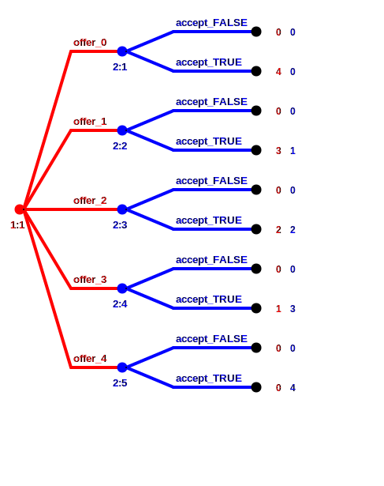
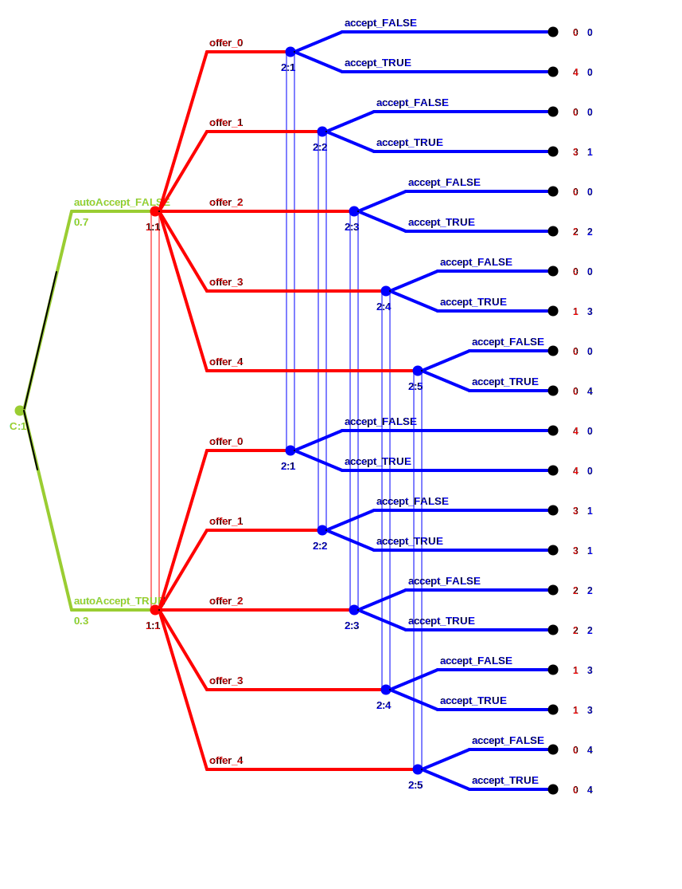

```{r setup, include=FALSE}
knitr::opts_chunk$set(echo = TRUE, error=TRUE)
library(gtree)
```

## Specifying a game

First, we load the `gtree` library that contains all functions to use gtree from R, but no shiny GUI. We also define a small simple Ultimatum game with the function `new_game`.

```{r}
library(gtree)
game = new_game(
  gameId = "UltimatumGame",
  options = make_game_options(verbose=TRUE),
  params = list(numPlayers=2,cake=4),
  stages = list(
    stage("proposerStage",
      player=1,
      actions = list(
        action("offer",~0:cake)
      )
    ),
    stage("responderStage",
      player=2,
      observe = "offer",
      actions = list(
        action("accept",c(FALSE,TRUE))
      )
    ),
    stage("PayoffStage",
      player=1:2,
      compute=list(
        payoff_1 ~ ifelse(accept, cake-offer,0),
        payoff_2 ~ ifelse(accept, offer,0)
      )
    )
  )
)
```


The `gameId` should be a unique name of the game. This is relevant if we want to conveniently save results, like computed equilibria, in the default folder structure used by `gtree`.

We then define a list of parameters `params`. Parameters can be referenced to in later definitions of the game. Note that you must *always* specify the number of players in a parameter called `numPlayers`. We also specify the size of the `cake` that can be distributed between the proposer and responder in the game.

Heart of our definition is a list of 3 `stages`. Each stage in the list should be generated with the function `stage` that sets defaults and transforms all formulas into a canoncial format.

1. In the first stage is named `proposerStage`. The argument `player=1`, specifies that player 1 acts here.
She chooses an action `offer`, that is created with the function `action` and element of a list `actions`. The function action first requires a name and then a set of possible values the action can take. Here we specify the set as a formula `~ 0:cake`. This means we compute the action set based on the specified parameters and possibly based on previously computed variables including chosen action values or realized moves of nature.<br>
Alternatively, we could also provide a fixed action set without formula e.q. `0:4`. This can not contain references to parameters or variables of the game and is always fixed when the game is created.

2. In the second stage player 2, observes the offer. This is specified by the argument `observe="offer"`. The argument observe specifies all observed variables as a simple character vector, or remains `NULL` if nothing is observed.<br>
Player 2 then decides whether to accept the action or not. Here we have chosen the fixed action set `c(FALSE,TRUE)`. You could encode specify the set for accept in a different way, e.g. as a character vector `c("reject","accept")` or an integer vector `c(0,1)`. 


3. The third stage just computes variables as specified by the list provided for the field `compute`. You can briefly specify a computation with the formula syntax `name ~ formula`.  Note that for each player `i` you must compute somewhere in your game the variable `payoff_i`, like `payoff_1` and `payoff_2`, that specifies the (monetary) payoff for that player. We can later easily transform these monetary payoffs, using some alternative outcome based utility function, e.g. to account for inequality aversion or loss aversion.
<br>You can use any vectorized, deterministic R function to specify a computed variable. Random variables must be declared separately, as a move of nature, however (see further below). Here we use the function `ifelse` for a simple distinction of two cases. For distinguishing more than two cases the functions `cases` in `gtreeCore` provides a simple syntax. Note that we could have more compactly written:
`payoff_1 ~ (cake-offer)*accept` and `payoff_2 ~ offer*accept`
<br>For computing equilibria, it does not really matter which players you specify a stage in which no action takes place. However, `gtree` also has (currently rudimentary) features to run a game as a web-based experiment. When running as an experiment, a stage will be shown to all players that are specified in the `players` field. If an action is taken in a stage, exactly ONE player must be specified. For stages without actions, you can specify any number of players including no player.

We can get a short overview of a specified game by typing its variable name in the R console.
```{r}
game
```

## Compiling and Solving for equilibria

In order to compute equlibria `gtree` will create different internal representations of the game. While the function `game_solve_spe` will automatically call the corresponding functions, it is useful to call them manually before.
```{r}
game_compile(game, for.internal.solver = TRUE)
game
```
We now see some additional information about the size of the game in terms of number of outcomes, information sets, subgames and number of pure strategy profiles.

As a game tree our game looks as follows:


Remark: By default `game_compile` only computes the information neccessary to create a game tree that can be saved as a Gambit `.efg` file and then solved via Gambit. For finding pure strategy equilibria, usually (but not always) the internal `gtree` solver is faster. It will compute some additional information, e.g. identifying in which information sets new subgames start. The argument `for.internal.solver` forced the computation of this additional information.

Ok, let us now solve the game. More precisely, we use the internal solver to find all pure strategy subgame (SPE) perfect equilibria.
```{r}
game_solve_spe(game)
```

### Equilibrium outcomes

The following code shows the equilibrium outcomes, i.e. all actions and computed variables on the equilibrium path. 
```{r}
game.eq.outcomes(game)
```
We have two different equilibrium outcomes: the proposer either offers 
0 or 1 and the equilibrium offer will be accepted. For games with moves of nature there is also a function `game.expected.eq.outcomes` that shows expected equilibrium outcomes.

Remark on my naming convention for functions: A function that starts with `game.` takes as first argument a game object but does not return a game object. In contrast, a function starting with `game_` takes a game object as first argument and always returns a game object.


### Equilibria represented as action tables

An equilibrium also describes equilibrium play off the equilibrium path, e.g. it describes whether player 2 would `accept` an out-off-equilibrium `offer` of e.g. 3.

In gtree there are different ways to represent the computed equilibria. Here is one convenient represetation for pure strategy equilibria:
```{r}
game.eq.tables(game, combine=2, reduce.tables = TRUE)
```
We have a list with a `tibble` for every action variable.

  - The first table describes the equilibrium offers: In the first equilibrium the offer is 1 and in the 2nd it is 0.
  
  - The second table describes the conditional `accept` decisions: In the first equilibrium an offer of `0` is rejected, in all other cases the offer is accepted.
  
The argument `combine` can take the values 0,1 and 2 and describes how the results of different equilibria are combined. For example, with `combine = 0`, we would get a separate list for every equilibrium. The argument `reduce.tables` automatically removes key columns that have no impact on the chosen equilibrium action.

We think that such a representation of equilibria is quite intuitive and convenient when comparing equilibrium predictions with experimental results.

### Internal representation of equilibria

Yet, there is a different internal representation of equilibria that allows quicker game theoretic analysis. To understand the internal representation it is first useful to show all possible outcomes of the game:
```{r}
game.outcomes(game, reduce.cols=TRUE)
```
This data frame corresponds to all possible full paths that can be taken through the game tree. It does not describe the complete game tree since information sets are not specified.

Let us now show the internal representation of equilibria:
```{r}
game.eq.li(game)
```
It is a list with a matrix for each equilibrium. Each row corresponds to one possible outcome of the game and the column describe for each action the equilibrium choice probability on the corresponding outcome path. 


The attribute `info.set.probs` shows the most compact equilibrium representation. It is just a numerical vector that describes the move probability for every possible move in every information set. This is similar to the equilibrium representation that you get if you manually call a Gambit solver on an `.efg` file (except that Gambit has a different default ordering of the information sets). The information sets are further described in the `game` object. In principle you can access the information, e.g. by typing
```{r}
game$tg$ise.df
```
Yet, there should not be any need to dig so deeply into the internal game representation of `gtree`.

## Setting different preferences

So far we assumed that the specified payoffs `payoff_1` and `payoff_2` are equal to players' utility. One motivation for gtree is to conveniently solve games for different specifications of players' preferences that can account e.g. for inequality aversion or loss aversion.

While in principal one could account for different outcome based preferences, by directly adapting the formulas for `payoff_1` and `payoff_2` in the game definition, we prefer a slightly different approach.

In the preferred approach the specified payoffs in the game definition are interpreted as monetary or material payoffs. This means games created by `new_game` can very closely match the structure of economic experiments, for which we only know the specified monetary payoffs. 

After the game is specified, we can use the function `game_set_preferences` to specify a utility function for which we want to find equilibria.

For example, consider the following inequality aversion utility function (Fehr and Schmidt, ????)
\[
u_i = \pi_i 
  - \alpha \frac {1}{n-1}\sum_{j \ne i} \max(\pi_j - \pi_i,0)
  + \beta \frac {1}{n-1}\sum_{j \ne i} \max(\pi_i - \pi_j,0)
\]
where \pi denotes material utilities.

The following code manually specifies these preferences and solves for subgame perfect equilibria:
```{r}
prefs = pref_custom(
  util_1 = payoff_1 - alpha*(pmax(payoff_2-payoff_1,0)) - beta*(pmax(payoff_1-payoff_2,0)),
  util_2 = payoff_2 - alpha*(pmax(payoff_1-payoff_2,0)) - beta*(pmax(payoff_1-payoff_2,0)),
  params = list(alpha = 1, beta=0.5),
  label = "ineqAv_100_50"
)

game %>%
  game_set_preferences(prefs) %>%
  game_solve_spe(game) %>% 
  game.eq.tables()
```
We see that with inequality aversion with an envy parameter of `alpha=1` and a guilt parameter of `beta=0.5` there is a unique SPE in which the proposer offers half of the cake.

Some common preference clases that are only transformations of material payoffs are included into gtree. All functions start with the prefix `pref_`. The following code verifies that guilt is not essential for positive offers by the proposer.

```{r}
game %>%
  game_set_preferences(pref_ineqAv(alpha=1,beta=0, player=1:2)) %>%
  game_solve_spe(game) %>% 
  game.eq.tables()
```

We will discuss later how one can specify heterogenous preferences via different preference types.

## Moves of Nature

The following code generates a game that has an initial stage with a move of nature, a.k.a. a random variable, `autoAccept`. With probability 20% an offer will always be automatically accepted, even if the responder wants to reject it. The effect of `autoAccept` is  specified in the `payoffStage`. No player observes `autoAccept`.
```{r}
game = new_game(
  gameId = "UltimatumGame",
  params = list(numPlayers=2, cake=4),
  options = make_game_options(verbose=FALSE),
  stages = list(
    stage("autoAcceptStage",
      nature=list(
        natureMove("autoAccept", c(FALSE,TRUE),probs = c(0.8,0.2))
      )
    ),
    stage("proposerStage",
      player=1,
      actions = list(
        action("offer",~0:cake)
      )
    ),
    stage("responderStage",
      player=2,
      observe = "offer",
      actions = list(
        action("accept",c(FALSE,TRUE))
      )
    ),
    stage("PayoffStage",
      player=1:2,
      compute=list(
        payoff_1 ~ ifelse(accept | autoAccept, cake-offer,0),
        payoff_2 ~ ifelse(accept | autoAccept, offer,0)
      )
    )
  )
) %>%
  game_solve_spe() %>%
  game.eq.tables(ignore.keys="autoAccept")

# Show size information only 
print(game, show.stages=FALSE, show.eq=FALSE)
```

While the number of strategy profiles and information sets stays the same, we now only have a single subgame. The reason is that a new subgame only begins if a player perfectly knows the outcomes of all previous moves of natures and all previous actions. Since no player observes the initial realization of `autoAccept` 



Since autoAccept is drawn at the beginning of the game and not observed 
by anybody, we only have a single subgame.
```{r}
tg = vg.to.tg(vg)
tg
efg = tg.to.efg(tg,file = NULL)
```

```{r}
eq.li = gtree.solve.spe(tg)
length(eq.li)
```

```{r}
eq.tables(eq.li[[29]],tg)
```


# Internal representation

## Table-form representation

Before we can solve for equilibria of a game, we have to create a table-form representation of the game using the function `vg.to.tg`.

```{r}
tg = vg.to.tg(vg)
```

Briefly spoken a table form game describes the extensive form of the game using several data frames. While this representation uses more memory than common tree representations like nested lists or linked lists, it benefits from R's ability (strongly enhanced by the `dplyr` and `data.table` packages) to quickly manipulate tabular data.
A detailed explanation of the internal structure of the different game representations is given in another vignette. 

The game tree of our ultimatum game looks as following:

```{r include=FALSE}
tg.to.efg(tg, path=getwd())
```
(To generate such a graphical representation of the game tree, use the function `tg.to.efg` to export the game to Gambit's extensive form game format and open the file with the [Gambit GUI](http://www.gambit-project.org/).)

We can get some basic information about the extensive form representation by printing the `tg` variable.
```{r}
tg
```
We see that there are 10 possible outcomes, i.e. terminal nodes of the game tree. Player 1 has a single information set, and player 2 has 5 information sets (one for each possible observed offer).

Recall that a pure strategy for player i, specifies a move for each of the players information set. While player 1 has thus only 5 different pure strategies, player 2 has 2^5=32 pure strategies. A pure strategy of player 2 specifies for each of the 5 possible offers whether to accept or reject. Hence, we have a total 5*32=160 pure strategy profiles in this small ultimatum game.

This game also has 6 different subgames. Solving for subgame perfect equilibria via backward induction, we effectively only have to look at 15 different strategy profiles.
